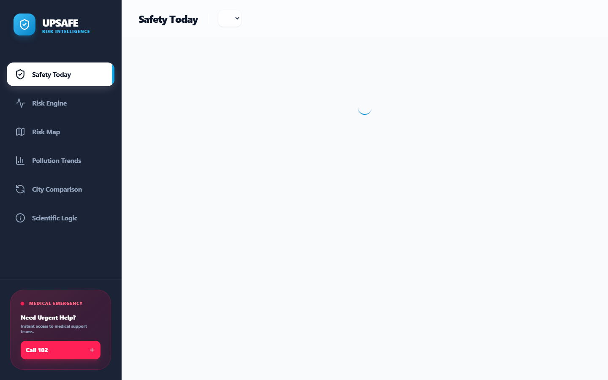
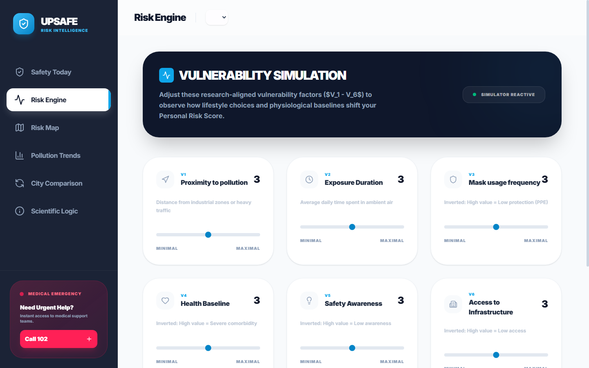
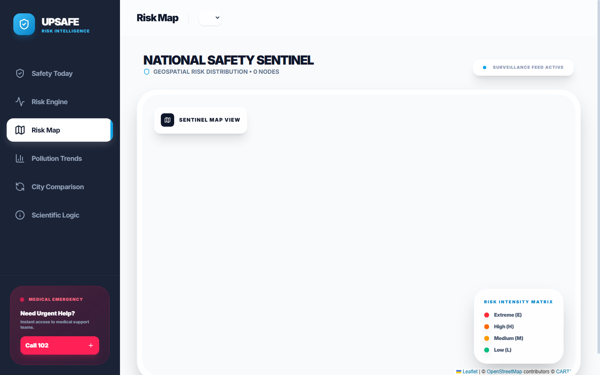
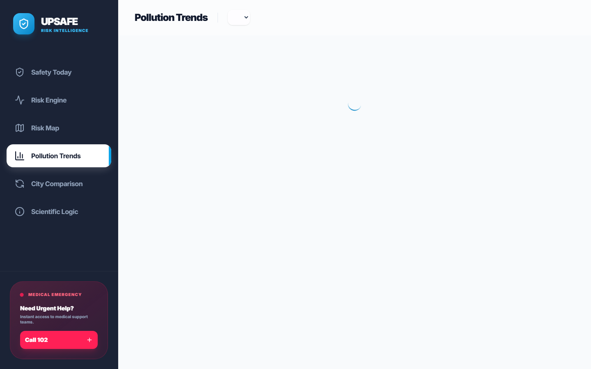

# UPSAFE: Personal Risk Surveillance & Assessment System

[](https://fastapi.tiangolo.com/)
[](https://reactjs.org/)
[](https://tailwindcss.com/)
[](https://pandas.pydata.org/)
[](https://numpy.org/)

An advanced, data-driven framework and interactive platform designed to assess, monitor, and mitigate individual health risks associated with ambient air pollution in major Indian cities. UPSAFE quantifies risk by integrating historical environmental datasets with dynamic personal vulnerability profiles.

---

## 📸 Interface Preview

### 1. Safety Today (Dashboard)
Displays the current air safety status, computed risk classification, and advanced medical advisories tailored to the user's location.


### 2. Risk Engine & Personal Inputs
Enables users to input dynamic personal parameters (exposure duration, proximity to traffic, mask usage, pre-existing health issues) to calculate their Cumulative Vulnerability Score (CVS) and adjust risk levels.


### 3. Interactive Risk Map
Visualize relative risk indicators across multiple cities in India to make informed travel or relocation decisions.


### 4. Historical Pollution Trends
Deep-dive analysis of historical AQI trends over time to identify seasonal spikes and baseline exposure.


---

## 🔬 Scientific Methodology

The core engine implements calculations derived from air quality safety research:

### 1. Cumulative Vulnerability Score (CVS)
The CVS aggregates individual behavior and environmental proximity into a single safety metric (ranging from 1.0 to 5.0):

$$\text{CVS} = \frac{\sum_{i=1}^{n} V_i}{n}$$

Where $V_i$ represents risk parameters:
- **Proximity** to high-pollution zones (e.g., traffic)
- **Exposure** duration outdoors
- **Mask Usage** frequency and grade
- **Health** status (pre-existing respiratory/cardiovascular issues)
- **Awareness** level
- **Infrastructure** (availability of indoor air purifiers)

### 2. Likelihood Adjustment
A CVS score $\ge 3.0$ triggers a $+1$ shift in environmental hazard likelihood, reflecting how personal vulnerability compounds external air quality risks.

### 3. Personal Risk Surveillance (PRS) Matrix
The system maps the adjusted likelihood and environmental impact (calculated from maximum AQI levels) into a 4-tier risk classification:
* **E**: Extreme Risk (Critical atmospheric hazard, immediate threat)
* **H**: High Risk (Severe physiological strain, restrict movement)
* **M**: Medium Risk (Moderate exposure, limit physical exertion)
* **L**: Low Risk (Safe conditions, normal activity)

### 4. Financial Risk Quantification (SLE & ALE)
We model potential health-related financial losses using Quantitative Risk Analysis:
- **Single Loss Expectancy (SLE):** Calculated as $\text{Asset Value (AV)} \times \text{Exposure Factor (EF)}$ (where AV is benchmarked at $500,000$ INR).
- **Annualized Loss Expectancy (ALE):** Calculated as $\text{SLE} \times \text{Annualized Rate of Occurrence (ARO)}$.

---

## 🛠️ Tech Stack

### Backend
- **Framework:** FastAPI
- **Data Processing:** Pandas, NumPy
- **Server:** Uvicorn
- **Validation:** Pydantic

### Frontend
- **Framework:** React (Vite)
- **Styling:** TailwindCSS
- **Charts:** Recharts (responsive SVG charts)
- **Maps:** Leaflet & React-Leaflet
- **Icons:** Lucide React

---

## ⚡ Quickstart Guide

### Prerequisites
- Node.js (v18+)
- Python (v3.9+)

### 1. Run the Backend API
1. Navigate to the backend directory:
   ```bash
   cd backend
   ```
2. Install dependencies:
   ```bash
   pip install -r requirements.txt
   ```
3. Run the FastAPI server:
   ```bash
   python main.py
   ```
   The backend will be available at `http://localhost:8000`.

### 2. Run the Frontend Dashboard
1. Navigate to the frontend directory:
   ```bash
   cd frontend
   ```
2. Install dependencies:
   ```bash
   npm install
   ```
3. Run the development server:
   ```bash
   npm run dev
   ```
   Open your browser and navigate to `http://localhost:5173`.

---

## 📊 Dataset Reference
The system utilizes historical air quality data from the `India_AirQuality_MachineLearning_Dataset.csv` containing records of AQI, PM2.5, PM10, and other pollutant levels in major Indian cities.
